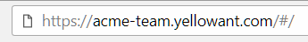

# How to Signup

YellowAnt accounts exist within teams. All individuals in the team creates their own account within the YellowAnt team.

There are three ways to sign up on YellowAnt:

* Using Slack
* Using Microsoft Teams \(Coming Soon\)
* Using Email

This is covered in detail in their respective sections.

**How do YellowAnt teams work?**

Let's take an example.  
A member of team ACME is signing up on YellowAnt for the first time. He creates a team called acme-team on YellowAnt. The URL for the team is acme-team.yellowant.com and anyone from the same team would be in the same YellowAnt team as well. This is because all YellowAnt accounts \(Basic, Premium or Enterprise\) are billed at a team level.

The team URL looks like this:

**How does it work when using Slack?**

In a Slack team, when one of the team members signs up on YellowAnt, a new YellowAnt team with the same subdomain is created. Now, whenever a member of that Slack team joins YellowAnt, they are automatically part of the same YellowAnt team. This is because of the same reason i.e. billing takes place at a team level.

For example, the acme-team on slack has a corresponding acme-team on YellowAnt when signing up using Slack.

If Slack team URL is:

Then, YellowAnt team URL would be:

**How does it work when using Microsoft Teams?**

_Coming Soon._

