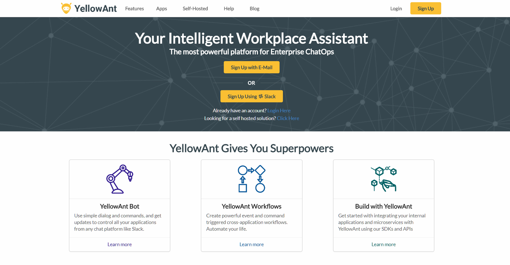
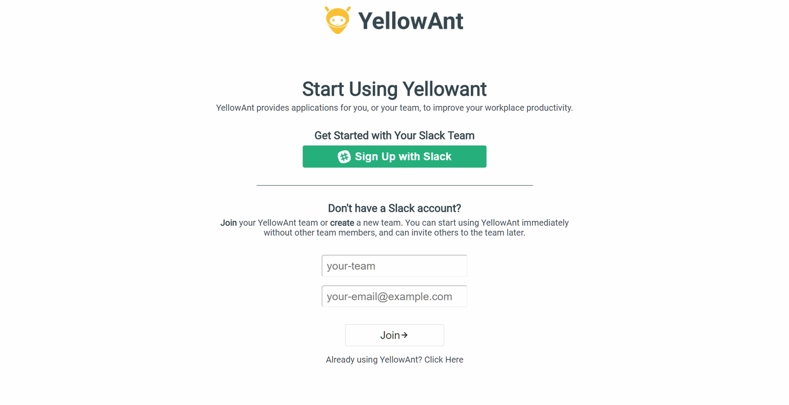
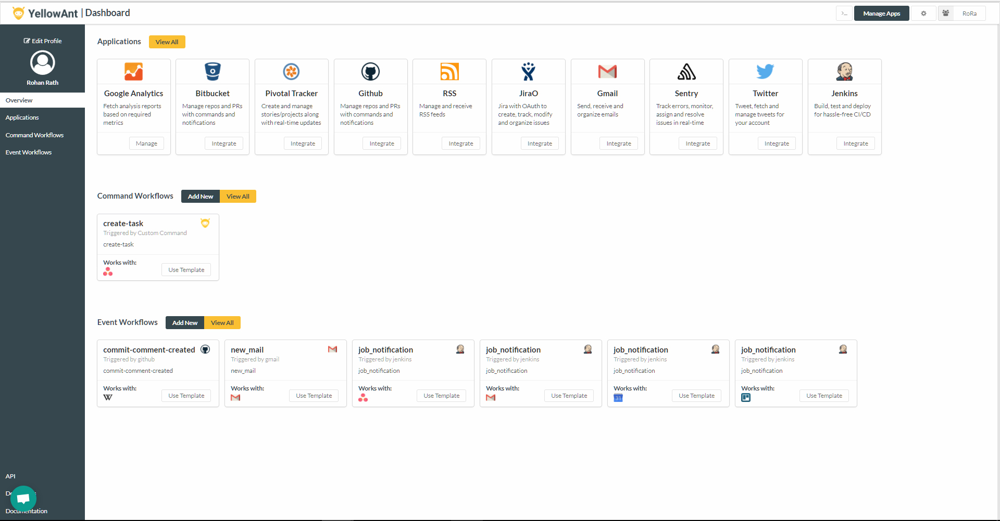

# Signup with Slack

Slack users can directly signup with their slack accounts by clicking on the “Sign Up with Slack”. After which you will be asked to log in your slack account. If you are already logged in your slack account then it will directly lead you to the authorization page, where after just once click you are good to go!

YellowAnt will create a team account with the same domain name as your Slack domain and makes your Slack Team owner the owner of the YellowAnt team account.

Let's take a look at the step by step process for signing up using Slack:

1. Go to www.yellowant.com and click on "Sign Up using Slack" or "Sign Up" in the header. 
2. If you clicked on the direct Slack Sign Up button, it takes you to the "Authorization" page and by clicking on the "Sign Up" button in the header, you are taken to a page where you have the option on Slack or Email. Click on "Sign Up with Slack"
3. Select your team on top right corner and click on "Authorize" once you've read the permissions.

4. You will be taken to the YellowAnt dashboard where you can start integrating applications.

