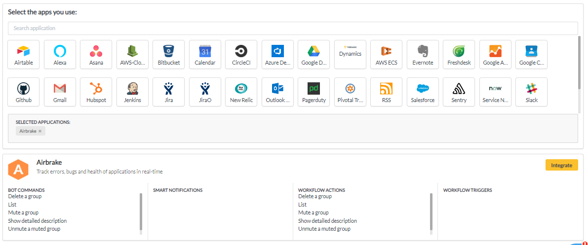

# Airbrake

1. Go to your YellowAnt Dashboard \([yoursubdomain.yellowant.com](https://github.com/yellowanthq/yellowant-help-center/tree/bdad19066023aa6a8b667a1d6f05b72945b49759/yoursubdomain.yellowant.com)\) or head over to the [YellowAnt Marketplace](https://www.yellowant.com/marketplace). 

       _YellowAnt Dashboard - Available Applications Panel_

    _YellowAnt Marketplace - Search or check out categories_

2. In the search bar, simply look for “AWS Cloudwatch”, or click on the icon. If you have already integrated the application, you will be able to see it under “My Applications”.

3. Once you find the application either in the dashboard or on the Marketplace click on view. You will be taken to a page where you'll find the integrate option/button. Click on the integrate button. 

4. You will be on the integration page which prompts you to add an account to the application. Click add account which takes you to the Airbrake Access page.  
Note: Select a team before you click "+ ADD ACCOUNT".  

5. In this step, YellowAnt asks you for the Airbrake User API Key.  

_You can find your API Key under settings&gt;permissions in your Airbrake account._  

6. Copy and paste that API Key in the text field on YellowAnt Integration page.

7. Airbrake is now integrated and you get a message on your chat application for the same. You will be able to see it under your applications in the Dashboard too.

