# AWS Cloudwatch

1. Go to your YellowAnt Dashboard \([yoursubdomain.yellowant.com](https://github.com/yellowanthq/yellowant-help-center/tree/bdad19066023aa6a8b667a1d6f05b72945b49759/yoursubdomain.yellowant.com)\) or head over to the [YellowAnt Marketplace](https://www.yellowant.com/marketplace).
2.  In the search bar, simply look for “AWS Cloudwatch”, or click on the icon. If you have already integrated the application, you will be able to see it under “My Applications”.

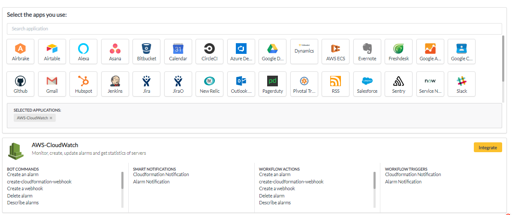

3. Once you find the application either in the dashboard or on the Marketplace click on view. You will be taken to a page where you'll find the integrate option/button. Click on the integrate button.

4. You will be on the integration page which prompts you to add an account to the application. Click add account which takes you to the AWS Cloudwatch Access page.  
Note: Select a team before you click "+ ADD ACCOUNT".  

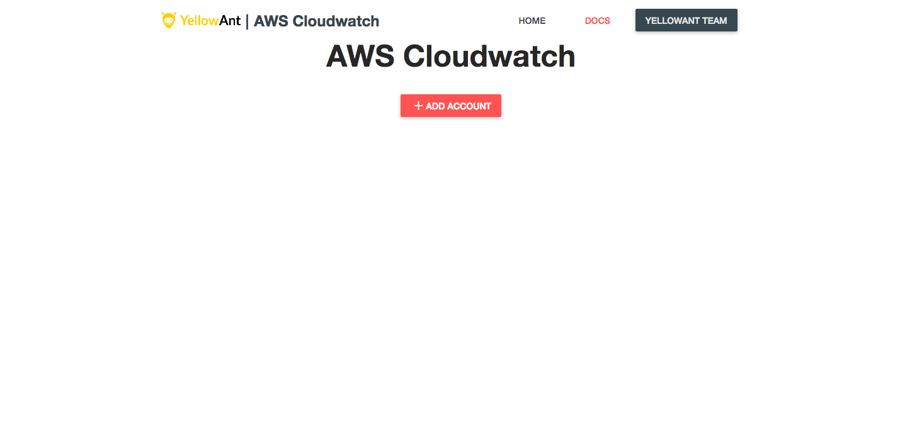

5. In this step, YellowAnt asks you for some details of your AWS Cloudwatch Account for authentication.  

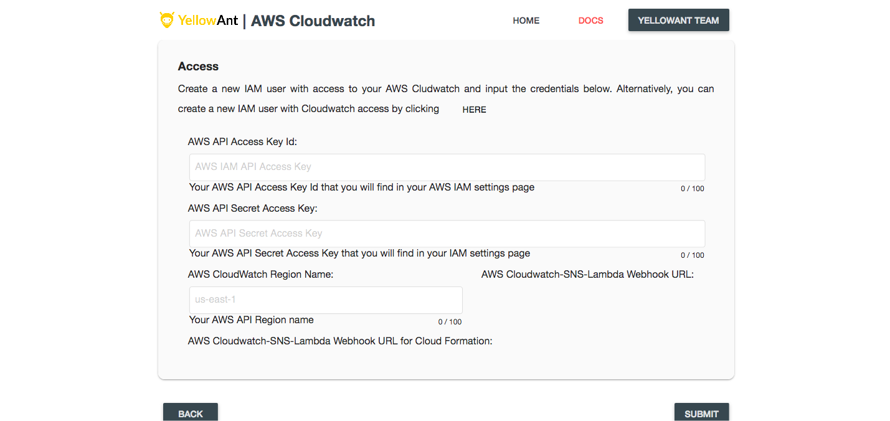

6. Fill in the details and hit "SUBMIT". Your screen should look like this:

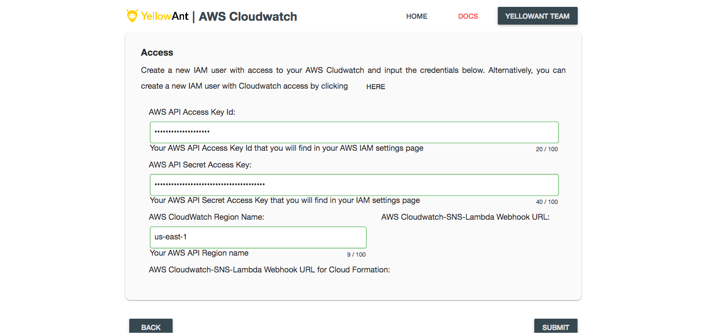

7. AWS Cloudwatch is now integrated and you get a message on your chat application for the same. You will be able to see it under your applications in the Dashboard too.

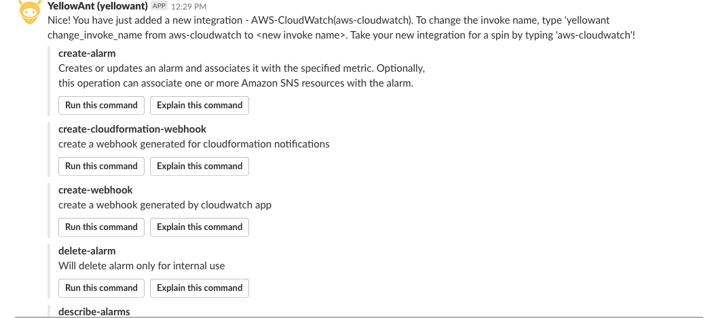

8. To get notifications, follow these steps: 

a. Select the "create-webhook"command on slack to get your url for webhook configurations.

b. Alternatively, you will also find the webhook url on your integrations page:

c. The next step is to set up your Cloudwatch alarm. For this, complete the following steps. Go to your SNS dashboard and create a new topic.

d. In the endpoint, past the url we received earlier

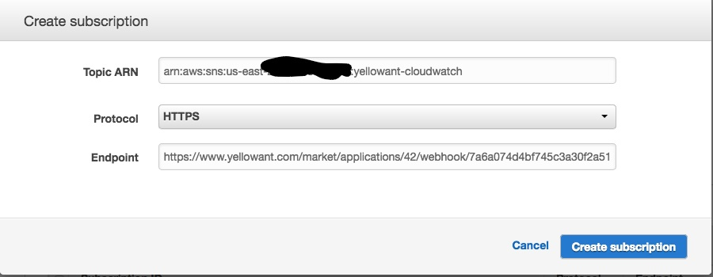

e. Click on "create subscription" to find a list of your subscriptions. Refresh this page to confirm.

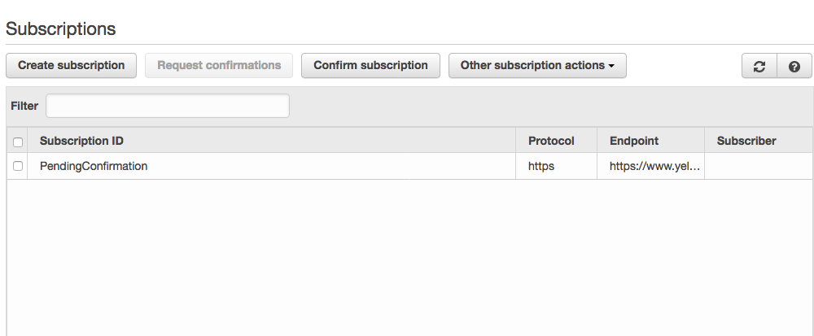

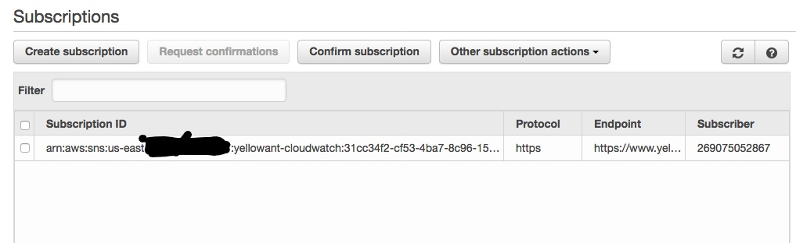

f. You will get a YellowAnt notification confirming your subscription

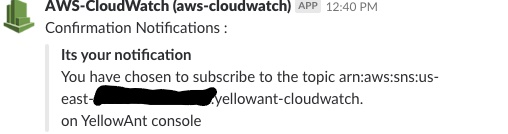

g. In your EC2 dashboard, select the topic which you created earlier, and click create alarm.

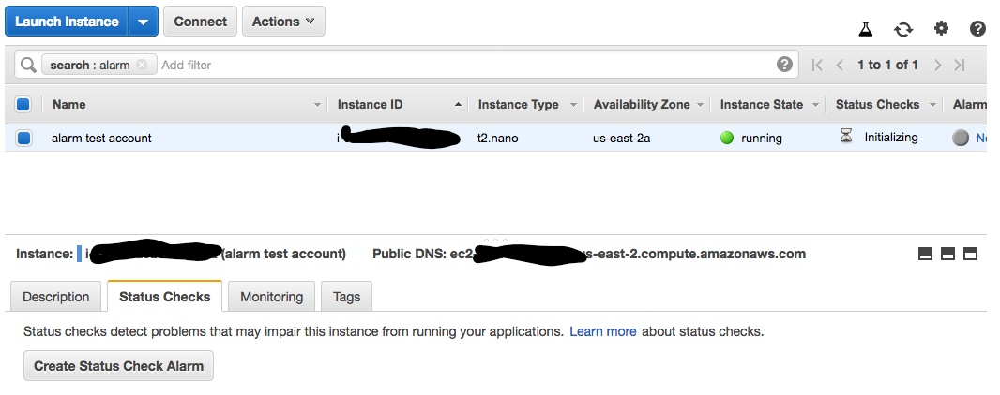

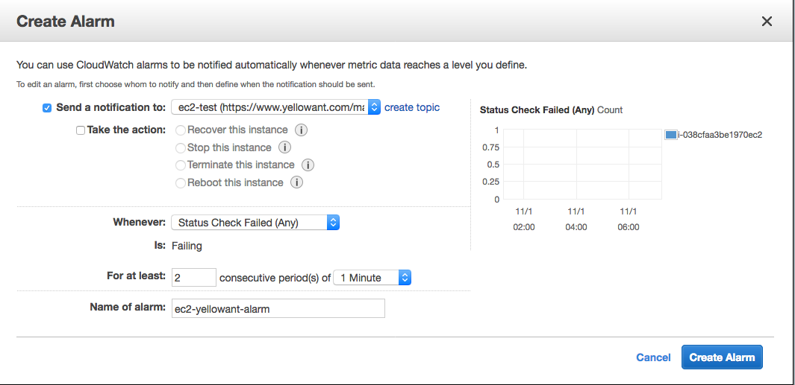

9. Your AWS Cloudwatch integration is complete and notifications are now set up!

