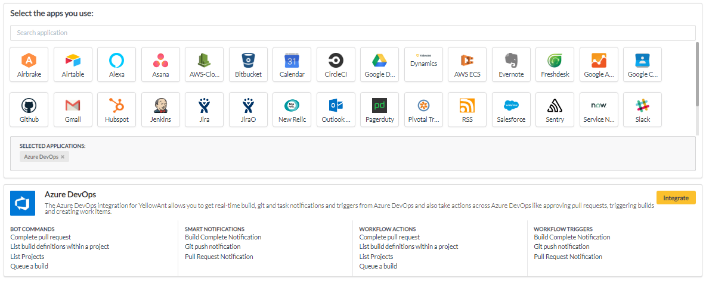
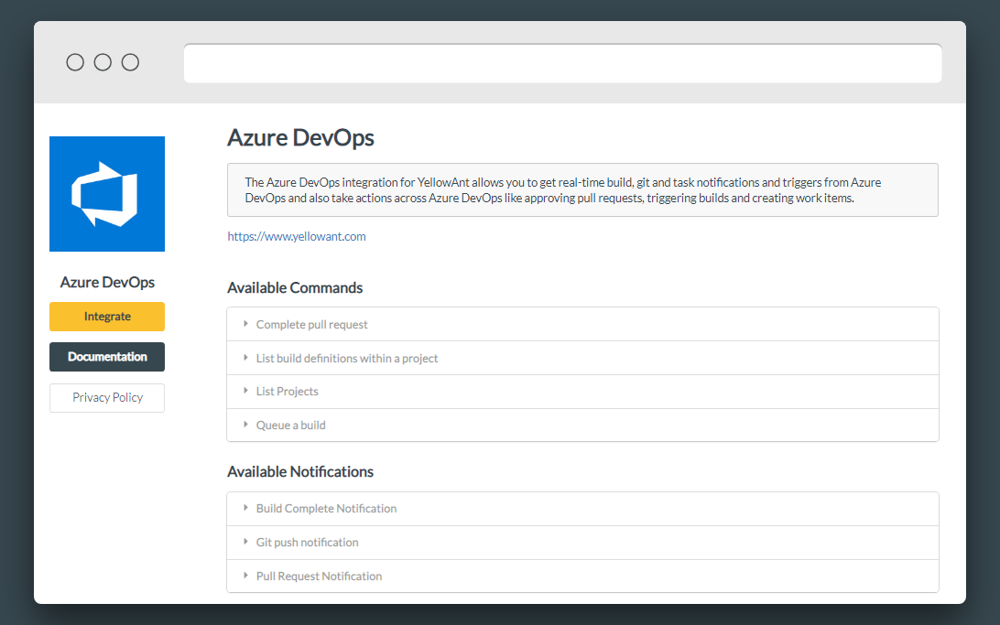
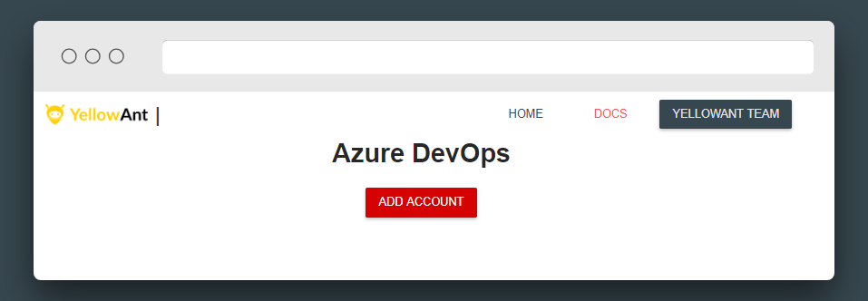
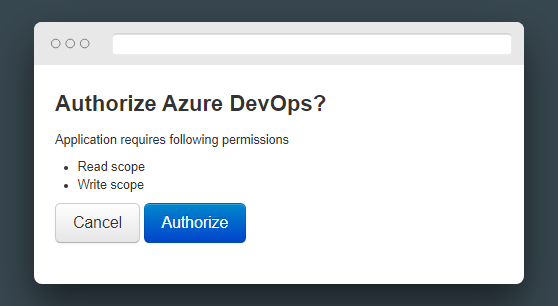
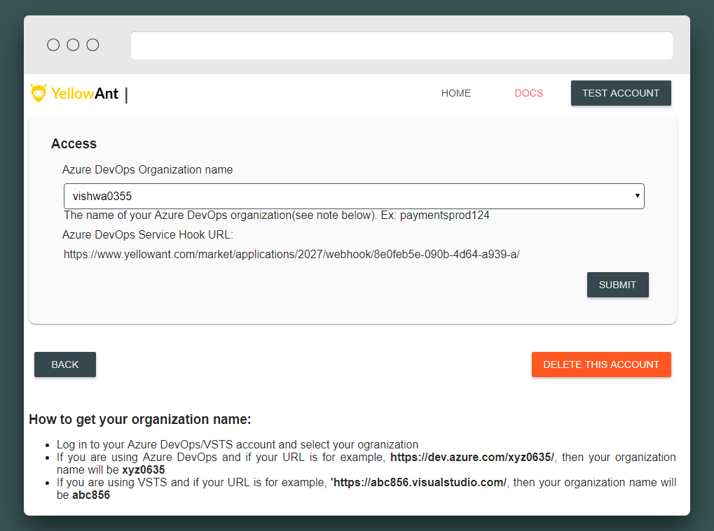
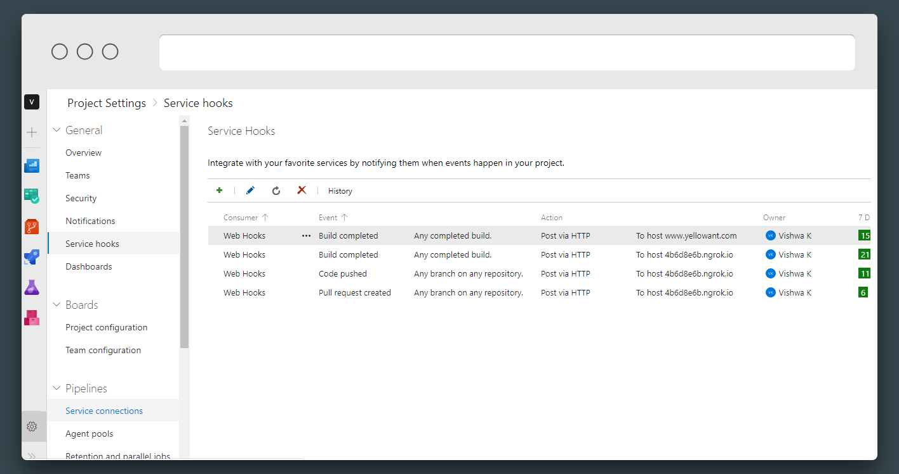
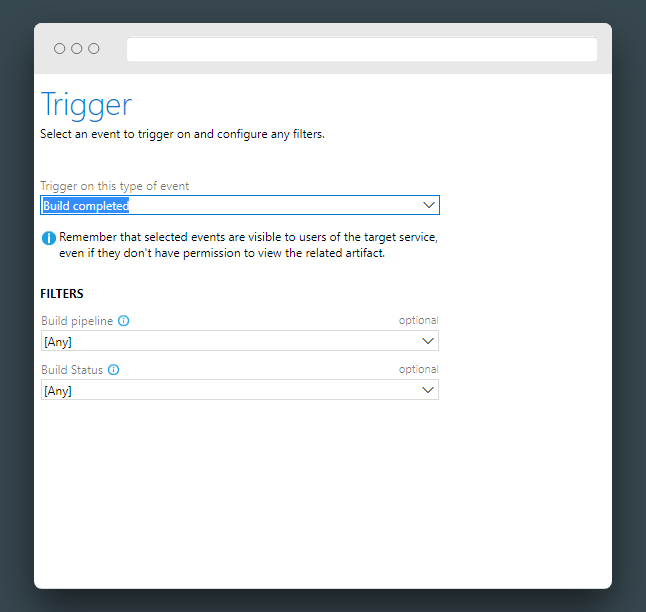
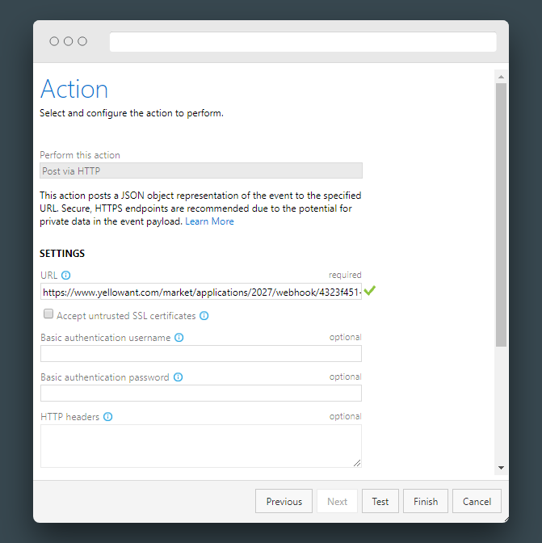

# Azure DevOps

1. Go to your YellowAnt Dashboard \([yoursubdomain.yellowant.com](https://github.com/yellowanthq/yellowant-help-center/tree/bdad19066023aa6a8b667a1d6f05b72945b49759/yoursubdomain.yellowant.com)\) or head over to the [YellowAnt Marketplace](https://www.yellowant.com/marketplace).

2.  In the search bar, simply look for “Azure DevOps”, or click on the icon. If you have already integrated the application, you will be able to see it under “My Applications”.

3. Once you find the application either in the dashboard or on the Marketplace click on Integrate. You will be taken to a page where you'll find the integrate option/button. Click on the integrate button.

4. You will be on the integration page which prompts you to add an account to the application. Click add account which takes you to the Azure DevOps OAuth page.  
Note: Select a team before you click "+ ADD ACCOUNT".

5. Give the necessary permissions to finish your integration**.**

6. Select the name of your organization, and click submit. 

7. Azure DevOps is now integrated and you get a message on your chat application for the same. You will be able to see it under your applications in the Dashboard too.

7. To set up YellowAnt notifications, follow these steps.

**Note for project Admins:** If you have admin permissions, YellowAnt will automatically create your Service Hooks for all projects within your organization for which you have admin access. For new projects, you will have to follow the steps below

**Note for non-admins:** If you do not have admin permissions, please follow the steps below to setup your notifications

\(i\) Go to the project for which you want webhooks. Then go to Project Settings, Service hooks. You can also use the following url for the same: 

[`https://dev.azure.com/{orgName}/{project_name}/_apps/hub/ms.vss-servicehooks-web.manageServiceHooks-project`](https://dev.azure.com/{orgName}/{project_name}/_apps/hub/ms.vss-servicehooks-web.manageServiceHooks-project)\`\`

\(ii\) Add a new Service Hook. Select a trigger.

\(iii\) In the next step, add the webhook url. The webhook url is: [`https://www.yellowant.com/market/applications/2027/webhook/4323f451-5e2a-47c6-a3d2-a/`](https://www.yellowant.com/market/applications/2027/webhook/4323f451-5e2a-47c6-a3d2-a/)\`\`

\(iv\) Click on 'Test' to see if YellowAnt sends a notification. Click "Finish". Repeat this process for all triggers you want to get notifications for. 

\(v\) Notification Service Hooks are set!

