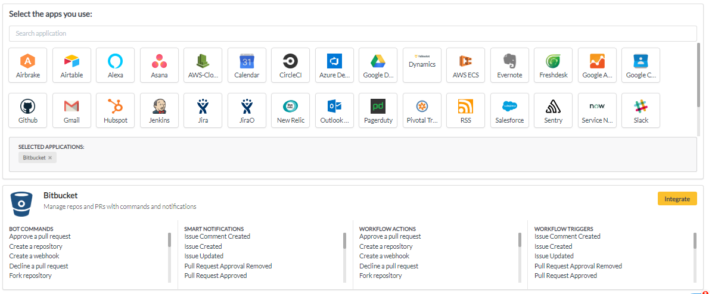

# Bitbucket

1. Go to your YellowAnt Dashboard \([yoursubdomain.yellowant.com](https://github.com/yellowanthq/yellowant-help-center/tree/bdad19066023aa6a8b667a1d6f05b72945b49759/yoursubdomain.yellowant.com)\) or head over to the [YellowAnt Marketplace](https://www.yellowant.com/marketplace).

2. In the search bar, simply look for "Bitbucket" under available applications. If you have already integrated the application, you will be able to see it under "My Applications"

3. Once you find the application either in the dashboard or on the Marketplace click on view. You will be taken to a page where you'll find the integrate option/button. Click on the integrate button.  

  
4. You will be on the integration page which prompts you to add an account to the application. Click add account which takes you to the Bitbucket OAuth page.  
Note: Select a team before you click "+ ADD ACCOUNT".  

5. Allow the needed permissions and Bitbucket is now integrated with YellowAnt.  

6. Bitbucket is now integrated and you get a message on your chat application for the same. You will be able to see it under your applications in the Dashboard too.

