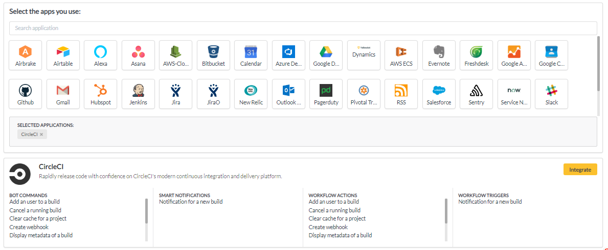

# Circle CI

1. Go to your YellowAnt Dashboard \([yoursubdomain.yellowant.com](https://github.com/yellowanthq/yellowant-help-center/tree/bdad19066023aa6a8b667a1d6f05b72945b49759/yoursubdomain.yellowant.com)\) or head over to the [YellowAnt Marketplace](https://www.yellowant.com/marketplace).

2. In the search bar,  look for "Circle CI" under available applications or simply click the icon. If you have already integrated the application, you will be able to see it under "My Applications".

3. Once you find the application either in the dashboard or on the Marketplace click on view. You will be taken to a page where you'll find the integrate option/button. Click on the integrate button.  

4. You will be on the integration page which prompts you to add an account to the application. Click "add account" which takes you to the Circle CI Access page.  
Note: Select a team before you click "+ ADD ACCOUNT".  

5. In this step, YellowAnt asks you for the Circle CI User API Key.  

6. You can find the API Key for Circle CI in your account using the following steps given below. Copy and paste that API Key in the text field on YellowAnt Integration page.

\(i\) Go to User Settings Panel

\(ii\) Go to Personal API Tokens in User Settings and click on Create New Token

\(iii\) Give a token name and click "Add API Token"

7. Once it generates a new API Token, copy it immediately and paste it in the YellowAnt integration page.

8. Circle CI is now integrated and you get a message on your chat application for the same. You will be able to see it under your applications in the Dashboard too.

