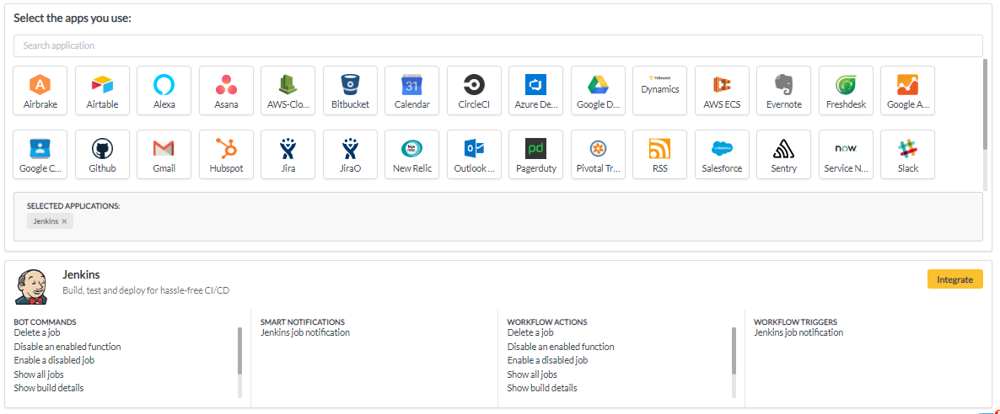
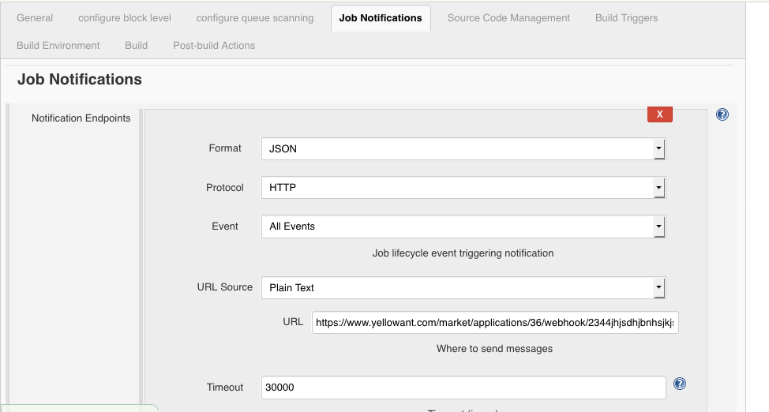

# Jenkins

1. Go to your YellowAnt Dashboard \([yoursubdomain.yellowant.com](https://github.com/yellowanthq/yellowant-help-center/tree/bdad19066023aa6a8b667a1d6f05b72945b49759/yoursubdomain.yellowant.com)\) or head over to the [YellowAnt Mark](https://www.yellowant.com/marketplace)etplace

2. In the search bar,  look for "Jenkins" or simply click the icon. If you have already integrated the application, you will be able to see it under "My Applications".

3. Once you find the application either in the dashboard or on the Marketplace click on Integrate. You will be taken to a page where you'll find the integrate option/button. Click on the integrate button.  

4. You will be on the integration page which prompts you to add an account to the application. Click "add account" which takes you to the Jenkins Access page.  
Note: Select a team before you click "+ ADD ACCOUNT".  

5. In this step, YellowAnt asks you for the Jenkins User API Key, Jenkins Application URL and Username.  

6. You can find the API Key for Jenkins in your account. Copy and paste that API Key in the text field on YellowAnt Integration page. Here's how to find your API Token:

\(i\) Go to the account page using your username in the top bar. Click on it.

\(ii\) Click on configure

\(iii\) Click on "Show API Token"

\(iv\) You can see your API key there, you can change it as needed, but make sure to change it on YellowAnt too

7. Copy your Jenkins API Token, go back to the Jenkins settings page and paste the token in the API Token box. Also make sure your Jenkins server URL is correct.

8. To configure Webhook notifications and for event workflows, copy the Webhook URL from your Jenkins integration settings page. Go to Jenkins and install the Jenkins Notifications plugin from the Jenkins marketplace.

9. Go to every job from which you need the build notifications. In the **Notification Endpoints,** in the URL Source-&gt;URL section, paste the webhook URL copied from the Jenkins-YellowAnt integration settings page. Click on **Save** to finish your Jenkins integration

