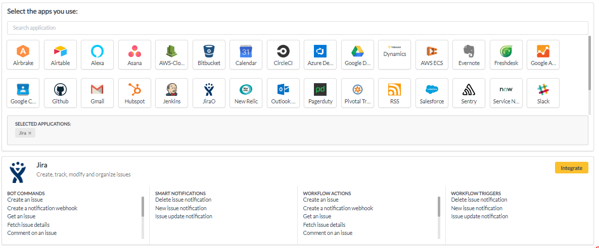

# Jira

1. Go to your YellowAnt Dashboard \([yoursubdomain.yellowant.com](https://github.com/yellowanthq/yellowant-help-center/tree/bdad19066023aa6a8b667a1d6f05b72945b49759/yoursubdomain.yellowant.com)\) or head over to the [YellowAnt Marketplace](https://www.yellowant.com/marketplace).

2. In the search bar, look for "Jira"ore simply click the icon. If you have already integrated the application, you will be able to see it under "My Applications".

3. Once you find the application either in the dashboard or on the Marketplace click on view. You will be taken to a page where you'll find the integrate option/button. Click on the integrate button.  

4. You will be on the integration page which prompts you to add an account to the application. Click add account which takes you to the Jira OAuth page.  
Note: Select a team before you click "+ ADD ACCOUNT".  

5. Jira requires you to use your Jira Team URL, Username and Password to authorize YellowAnt to access your data.  
**NOTE: YellowAnt has an application called JiraO which has the same capabilities but with OAuth login.**  

6. Jira is now integrated and you get a message on your chat application for the same. You will be able to see it under your applications in the Dashboard too.

7. To set up webhooks, follow these steps. Please note that only admin can add/change webhooks settings:

\(i\) Go to Site Admin, Application Settings, then Jira. 

\(ii\) Scroll Down to Advanced Settings, then webhooks. Name your application. 

\(iii\) Get the webhook url from your integrations page

\(iv\) Select all the issues you want notifications for. 

\(v\) Click "Create". Webhook integration is now complete

