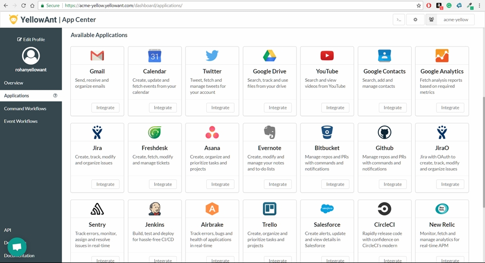
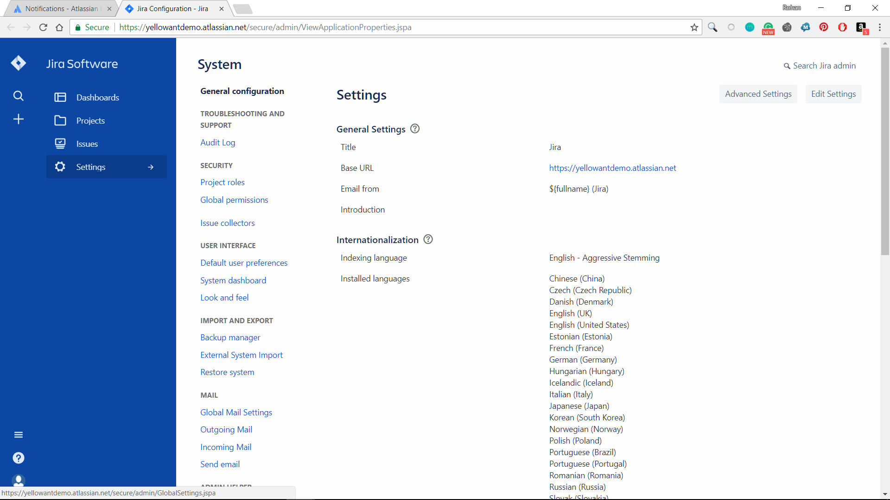
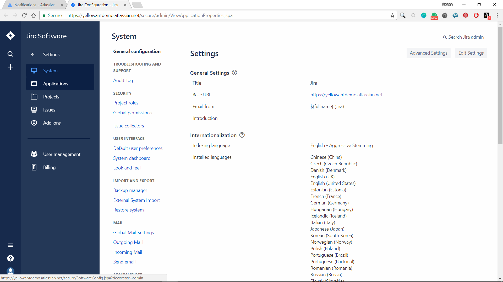
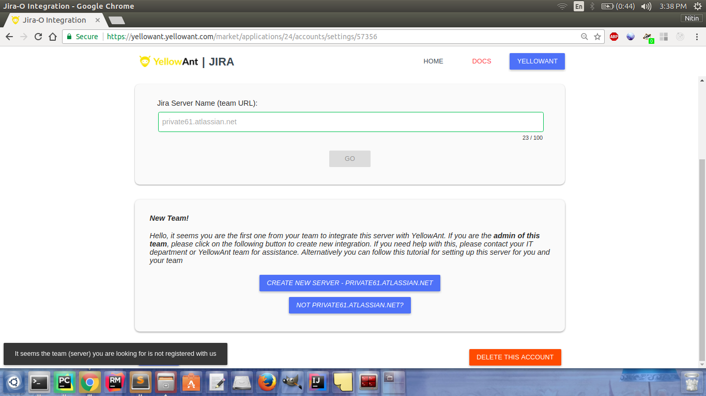
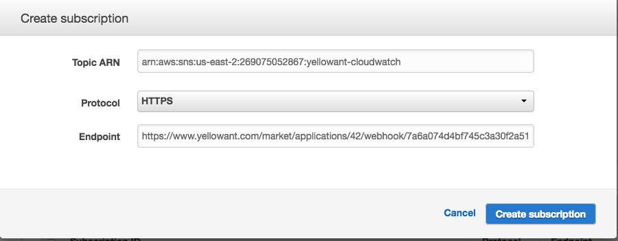
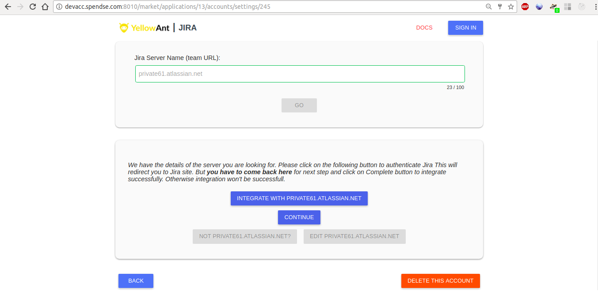

# JiraO

1. Go to your YellowAnt Dashboard \([yoursubdomain.yellowant.com](https://github.com/yellowanthq/yellowant-help-center/tree/bdad19066023aa6a8b667a1d6f05b72945b49759/yoursubdomain.yellowant.com)\) or head over to the [YellowAnt Marketplace](https://www.yellowant.com/marketplace). 

        _YellowAnt Dashboard - Available Applications Panel_

2. If you are in the dashboard, go to the tab called "Applications" and look for "JiraO" under available applications. If you have already integrated the application, you will be able to see it under "My Applications".

3. If you are in the Marketplace you can find JiraO under various categories such as all and project management. You can also search for this application in the search bar.  

4. Once you find the application either in the dashboard or on the Marketplace click on view. You will be taken to a page where you'll find the integrate option/button. Click on the integrate button.  

5. You will be on the integration page which prompts you to add an account to the application. Click add account which takes you to the JiraO OAuth page.  
Note: Select a team before you click "+ ADD ACCOUNT".  

6. Once you click on add account, you are taken to the Jira authentication page of YellowAnt where you have to provide some information. The following are the steps to authenticate Jira.

**You need to be a system administrator of the Jira account to be able to create application link \(which integrates Jira with YellowAnt\). If your Jira server is already registered with YellowAnt, you can skip to the steps starting from Step 7.    
**  
Note: For this tutorial we will be using a dummy Jira account - ‘private61.atlassian.net’.

\(i\) To create application link to JIRA, click on settings icon. Select the “Applications” option in the menu.  

_Image0A - Settings_

  
_Image0B - Applications_

\(ii\) Then under ‘Integrations’ section, click on Application Links. In text box enter ‘[https://yellowant.com/’](https://yellowant.com/’) and click on ‘Create new link’.  
 

_Image1 - Configure Application Links_

\(iii\) A box will appear asking you to verify link and continue.  

_Image2- Configure Application URL_

\(iv\) Now, fill in the details asked in next dialogue box as shown in Image3. Keep the ‘Consumer Key’ and ‘Shared secret’ confidential. Fill in the following details:

‘Request Token URL’ : ‘[https://www.yellowant.com/market/applications/24/requesttoken/’](https://www.yellowant.com/market/applications/24/requesttoken/’)

‘Access Token URL’: ‘[https://www.yellowant.com/market/applications/24/accesstoken/’](https://www.yellowant.com/market/applications/24/accesstoken/’)

‘Authorize URL’: ‘[https://www.yellowant.com/market/applications/24/authorize/’](https://www.yellowant.com/market/applications/24/authorize/’)

\(v\) Click continue.

_Image 3 - Link applications_

\(vi\) In the next dialogue box, enter the following details:

Consumer Key - same as done in the previous step.

Consumer name - ‘Yellowant’.

_Image 4 - Link applications_

Now, for the ‘Public Key’ we will head to YellowAnt \(at [https://www.yellowant.com/market/applications/24/accounts](https://www.yellowant.com/market/applications/24/accounts)\) and authorize YellowAnt. 

\(vii\) Once you are redirected to settings page, fill in your server name and click ‘GO’.  

_Image5 - Jira Team URL_

\(viii\) Click on ‘Create New Server – Your Server Name’ as shown in Image5  
\(ix\) Fill in the ‘Consumer Key’ and ‘Shared Secret’ \(mentioned as ‘Consumer Secret’\) you used in Jira and click ‘Generate SSL Public Key’.  
\(x\) Copy this ‘Public Key’ generated and head back to Jira where you left off.  

_Image6 - SSL Public Key_

\(xi\) Paste the key in ‘Public Key’ field and click continue.  
Your ‘Application Link’ in Jira is created but you haven’t saved server details in YellowAnt yet. 

\(xii\) Head back to YellowAnt where you left off. Fill in the passphrase.  
Note: You can edit the server details, only if you have the passphrase.

\(xiii\) Now after notification shows ‘Server details saved’, click on back and fill in the name of server and click ‘GO’.  
 

_Image7 - Passphrase_

7. Click on ‘Integrate with &lt;Your Server Name&gt;’ and allow YellowAnt to access Jira. 

_Image8 - Redirecting to OAuth Allow required permissions and then Jira will be integrated with YellowAnt.  
_

_Image9 - Allow permissions_

8. Now, final step, head back to YellowAnt page and click on the continue button.  

9. JiraO is now integrated and you get a message on your chat application for the same. You will be able to see it under your applications in the Dashboard too.

