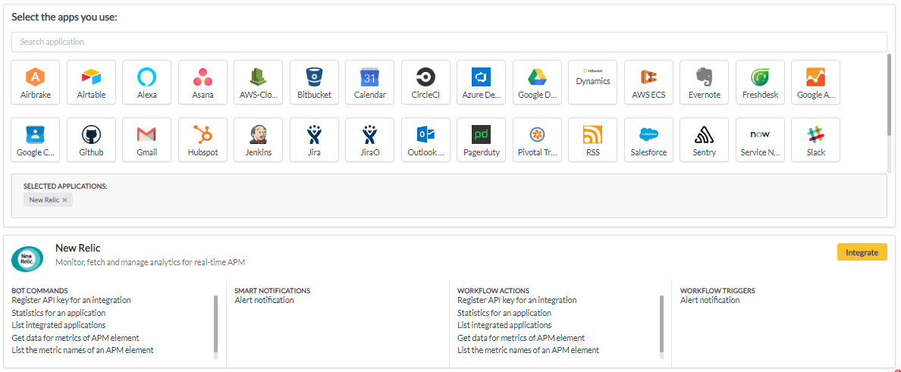

# New Relic

1. Go to your YellowAnt Dashboard \([yoursubdomain.yellowant.com](https://github.com/yellowanthq/yellowant-help-center/tree/bdad19066023aa6a8b667a1d6f05b72945b49759/yoursubdomain.yellowant.com)\) or head over to the [YellowAnt Marketplace](https://www.yellowant.com/marketplace).

2. In the search bar, look for "New Relic" or simply click the icon. If you have already integrated the application, you will be able to see it under "My Applications".

3. Once you find the application either in the dashboard or on the Marketplace click on view. You will be taken to a page where you'll find the integrate option/button. Click on the integrate button.  

4. You will be on the integration page which prompts you to add an account to the application. Click "add account" which takes you to the New Relic Access page.  
Note: Select a team before you click "+ ADD ACCOUNT".  

5. In this step, YellowAnt asks you for the New Relic User API Key.  

6. You can find the API Key for New Relic in your account. Copy and paste that API Key in the text field on YellowAnt Integration page. Here's how to find your API Token:

\(i\) Go to your "Account Settings".

\(ii\) Go to Integrations&gt;API Keys

\(iii\) Click on "Create REST API key".

\(iv\) Click on "Show Key" and copy this for YellowAnt's API Key Field.

7. New Relic is now integrated and you get a message on your chat application for the same. You will be able to see it under your applications in the Dashboard too.

