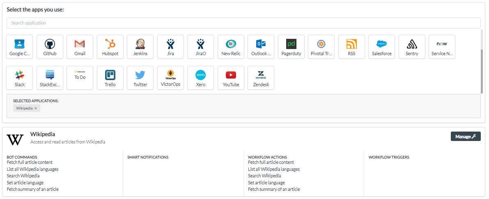

# Wikipedia

NOTE: Wikipedia is integrated as a default application for all users. Only in the event that you have removed this or you need two separate instances of the application do you need to integrate using the below steps. Wikipedia doesn't require your login details.

1. Go to your YellowAnt Dashboard \([yoursubdomain.yellowant.com](https://github.com/yellowanthq/yellowant-help-center/tree/bdad19066023aa6a8b667a1d6f05b72945b49759/yoursubdomain.yellowant.com)\) or head over to the [YellowAnt Marketplace](https://www.yellowant.com/marketplace).
2. In the search bar, look for "Wikipedia" under available applications. If you have already integrated the application, you will be able to see it under "My Applications".

3. Once you find the application either in the dashboard or on the Marketplace click on view. You will be taken to a page where you'll find the integrate option/button. Click on the integrate button.

4. Since Wikipedia doesn't take any user login, with that simple step, it is now integrated and you get a message on your chat application for the same. You will be able to see it under your applications in the Dashboard too.

