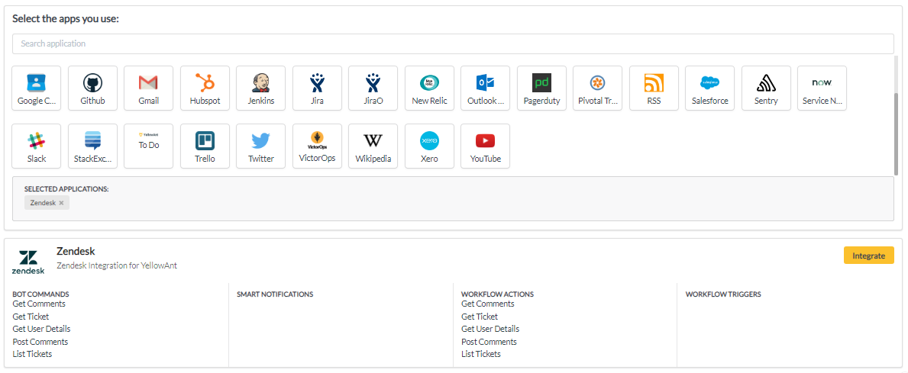

# Zendesk

1. Go to your YellowAnt Dashboard \([yoursubdomain.yellowant.com](https://github.com/yellowanthq/yellowant-help-center/tree/bdad19066023aa6a8b667a1d6f05b72945b49759/yoursubdomain.yellowant.com)\) or head over to the [YellowAnt Marketplace](https://www.yellowant.com/marketplace).

2. In the search bar, look for "Zendesk" or simply click the icon. 

3. Once you find the application either in the dashboard or on the Marketplace click on Integrate. You will be taken to a page where you'll find the integrate option/button. Click on the integrate button.

4. You will be on the integration page which prompts you to add an account to the application. Click add account which takes you to the Zeendesk OAuth page.  
Note: Select a team before you click "+ ADD ACCOUNT".

5. Enter your  team's Zendesk name  in the prompt and select notification settings. Then click on "Submit", then "Integrate". Allow permissions when prompted by Zendesk.

7. Zendesk is now integrated and you get a message on your chat application for the same. You will be able to see it under your applications in the Dashboard too.

