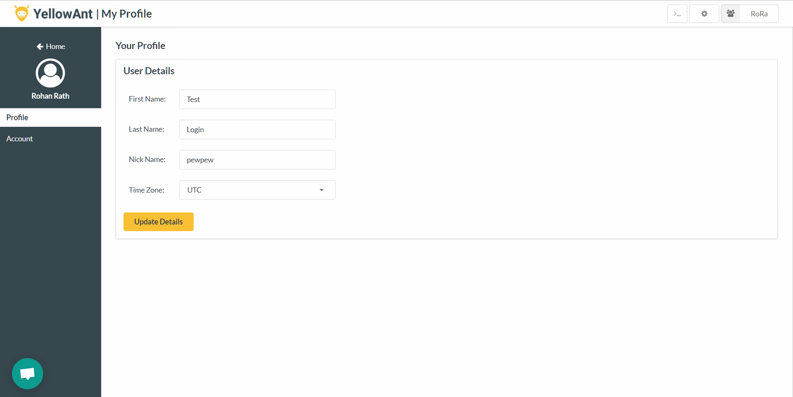
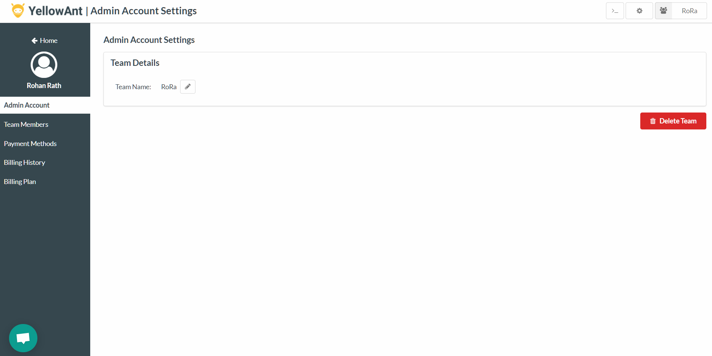
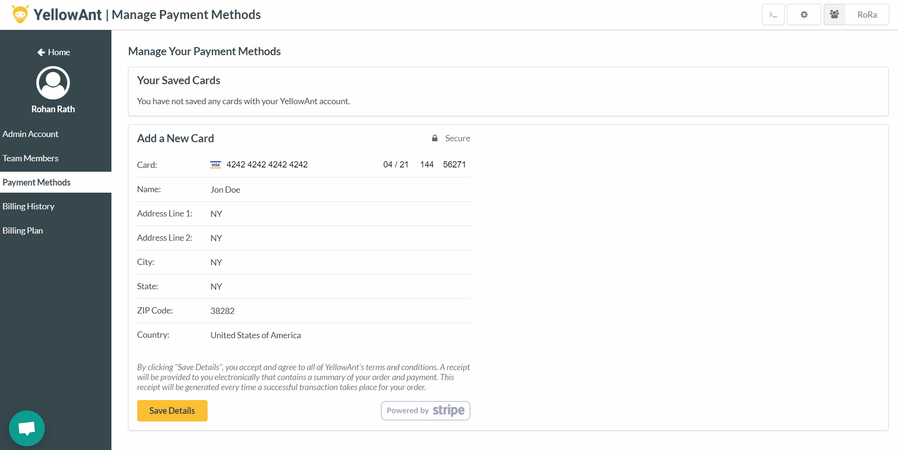

# Settings

The settings button in the header panel gives you 3 options:

1. Settings
2. Integrations
3. Admin

## Settings

The settings panel lets you update your profile and account settings. _Note: This is the same as "Edit Profile" in the dashboard's side panel._

**Profile**    
You can change your name, time zone and nickname from this panel:

**Account**    
Change your password or update global account settings from here:

## Integrations

The "Integrations" button takes you to the application management center for all your integrated applications. On the left panel, you can see all your integrated apps and the corresponding setting page for it. When you click on an application, you enter the settings page of that particular application. You can perform two operations from there:

* Change the application invoke name The invoke name is used to call apps with commands. For example, the default invoke name for GMail is 'gmail' and to send a mail, you must execute the command 'gmail send'. If you change the invoke name from 'gmail' to 'email', the corresponding send mail command becomes 'email send'.
* Change notifications settings YellowAnt subscribes you to a number of notification for each account of that application. If you don't wish to receive those notifications you can change them individually from here. 

_YellowAnt Application Management Center - Change invoke names and notification settings._

## Admin

The "Admin" panel is only visible to team owners and gives access to a whole lot of actions for administrators to use and cater to the entire team.

Admin Account: Holds the "Team Details" which has the team name. Please note, changing the team name would log out every team member:

Team Members: Holds the list of team members and an option to invite new users by simply adding their email ids:

Payment Methods: This section is used to manage payments for team who are on Basic and Premium plans. The administrator adds a card that is used to pay for YellowAnt:

Billing History: Contains entire billing history of past transactions:

Billing Plan: The panel where the administrator can change the team's YellowAnt plan - Free, Basic or Premium:

