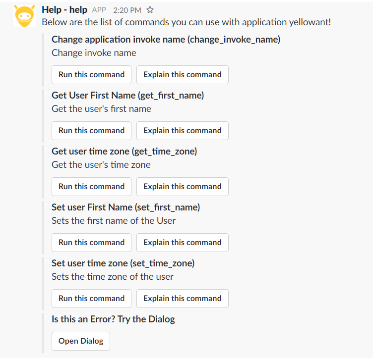
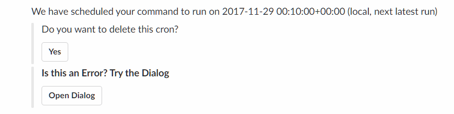

# System Commands

System Commands in YellowAnt let you administer and control your YellowAnt account. YellowAnt has three main system commands:

1. **yellowant**  
   YellowAnt is the system administrator application. It is basically used to fetch and update your user information.  
   You can perform the following actions using this:

   a. Change application invoke name: Used to change the name of the application invoke name from "yellowant" to whatever the user wishes to call it.

   b. Get User First Name: Fetches the first name of the registered user.

   c. Get user time zone: Fetches the time zone of the user.

   d. Set user First Name: Changes the first name of the user.

   e. Set user time zone: Sets the time zone of the user.

   

2. **help**  
   The help command in YellowAnt lets the user fetch important information about how to use a particular function or perform a certain action. The help command can be used in three ways:

   a. As a means to get assistance with YellowAnt platform. Used as meta-function to get information about their general configuration with respect to YellowAnt.  
   **Command: help**    
  

b. As a means to get assistance with a particular application. Using this lets you learn about the functions or actions available for an application/integration.  
**Command: help "appname"  
Example: help gmail**    

c. As a means to get very specific information about how a particular function of an application works. You can see how to execute it and what parameters are required to execute it.  
**Command: help "appname" "functionname"  
Example: help gmail send**    

3. **cron**    
The "cron" system function is used to schedule an action/function execution at a specific time. It can be used to create a one-time executable or a recurring executable. You can schedule a function to be executed at a particular time of the day weekly, hourly or only once.

You start with the command "cron" which gives you three functions:  
a. **Delete a Cron job:** Used to delete already scheduled jobs.    
****b. **List user Cron jobs:** Used to list scheduled jobs of the user.    
****c. **Schedule a Cron Job:** There are multiple ways to schedule jobs on YellowAnt.

Example:  
To schedule a task to fetch your asana tasks everyday at 10:00 AM  

To list the cron jobs you have:  

To delete already scheduled tasks, you can list and hit the "delete" button or use the delete function to do the same:  

