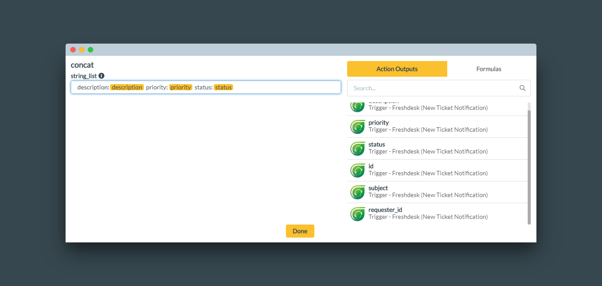
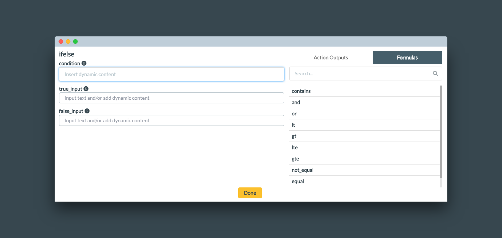

# Logical Functions

You can use concat and if-else formulas in a field. 

**concat**: The ‘concat’ function allows you to join text/dynamic input in 1 string. Just select the concat function and add the text/dynamic input you want to concatenate. 

**ifelse**: The if-else function allows you to you check a dynamic input for a condition and perform actions based on whether or not they are true. Once you select the ifelse function, a variety of formulas will be available to apply on your dynamic inputs:

* **contains** \(checks for whether a string is in a parent string\) 

* **and** \(combines 2 conditions such that the function is only true if both conditions are true\) 
* **or** \(combines 2 conditions such that the function is true if either condition is true\) 
* **lt** \(checks whether the variable on the left is less than the variable on the right\) 
* **gt** \(checks whether the variable on the left is greater than the variable on the right\) 
* **lte** \(checks whether the variable on the left is less or equal to than the variable on the right\) 
* **gte** \(checks whether the variable on the left is greater than or equal to the variable on the right\) 
* **not equal** \(compares 2 values and returns True if they are unequal\) 
* **equal** \(compares 2 values and returns True if they are equal\) expression

