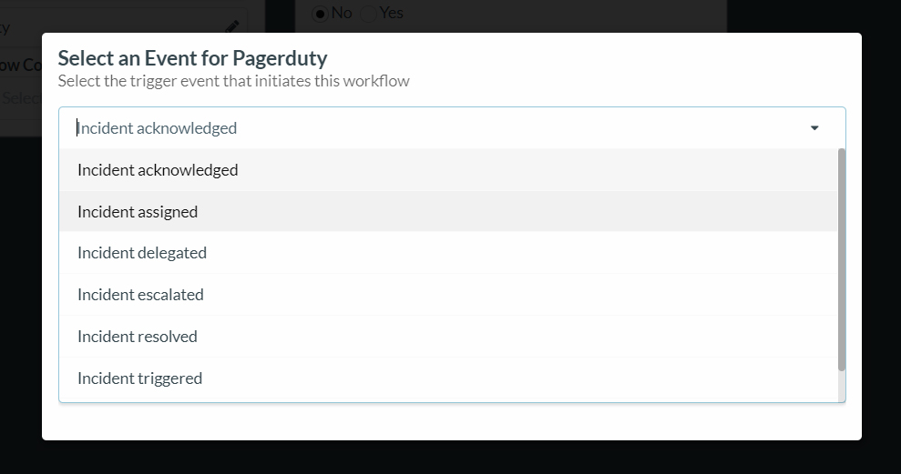
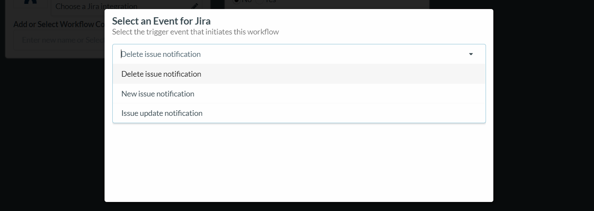
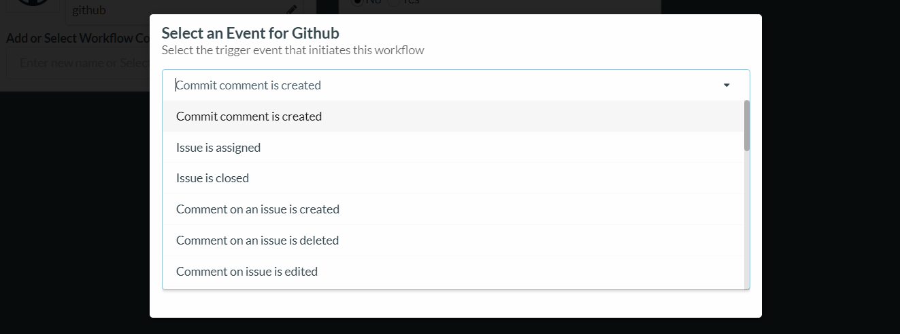

# Trigger

A trigger for an event workflow is an event across some application that initiates the execution of the workflow. This means the workflow carries out the entire chain of events only if this event trigger is met. When you start building a workflow, you will be asked to choose the trigger event in a trigger application.

Selecting an application in which the trigger event occurs.  
Selecting a specific event for the trigger application.

## Some examples of triggers in applications:

Trigger Events in Jira

Trigger Events in GitHub

Trigger Events in Jenkins

