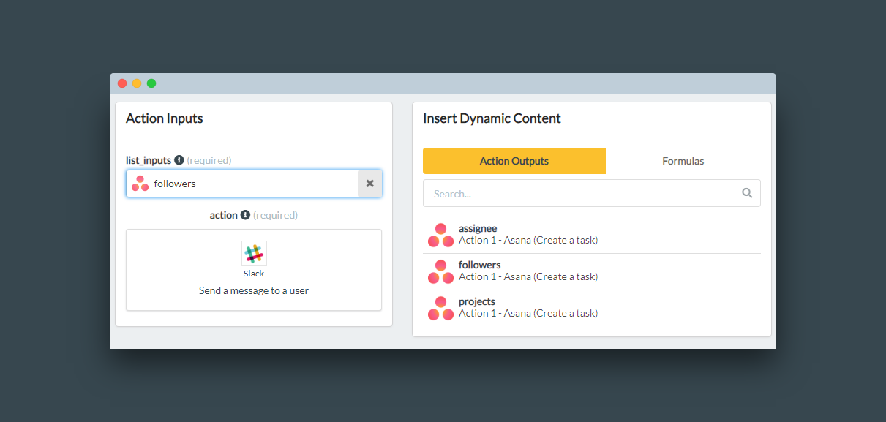
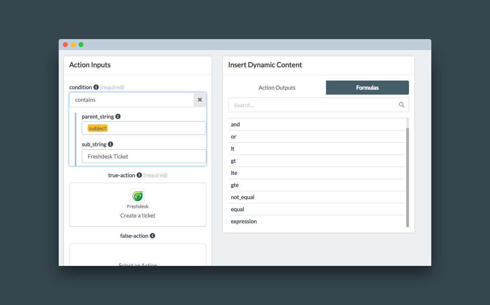

# Using Conditonal Actions

You can also take actions based on conditions. The conditional functions available in YellowAnt are “for” and “ifelse”

#### **for function:**

The “for” function allows you to take an action for every item in a list. To use the “for” function, select it as an action when you add an action.

**list\_inputs:** This is the list which will be looped and action will be taken on every item in the list. Pick from the dynamic content that becomes available when you click in the field

**action:** This is the action that will be repeated for each item in list\_inputs. You can add this action just like an “[Add Action](https://docs.yellowant.com/workflows/event-workflows/building-event-workflows/action)” step

#### **ifelse function:**

The if-else function allows you to you check a dynamic input for a condition and perform actions based on whether or not they are true.

**condition:** Once you select the ifelse function, a variety of formulas will be available to apply on your dynamic inputs:

* **contains** \(checks for whether a string is in a parent string\)
* **and** \(combines 2 conditions such that the function is only true if both conditions are true\)
* **Or** \(combines 2 conditions such that the function is true if either condition is true\)
* **lt** \(checks whether the variable on the left is less than the variable on the right\)
* **gt** \(checks whether the variable on the left is greater than the variable on the right\)
* **lte** \(checks whether the variable on the left is less or equal to than the variable on the right\)
* **gte** \(checks whether the variable on the left is greater than or equal to the variable on the right\)
* **not equal** \(compares 2 values and returns True if they are unequal\)
* **equal**  \(compares 2 values and returns True if they are equal\)
* **expression** \(custom logic\)

**true-action:** This action will be executed if the condition is TRUE. You can add this action just like an “[Add Action](https://docs.yellowant.com/workflows/event-workflows/building-event-workflows/action)” step

**false-action:** This action will be executed if the condition is FALSE. You can add this action just like an [“Add Action](https://docs.yellowant.com/workflows/event-workflows/building-event-workflows/action)” step  

